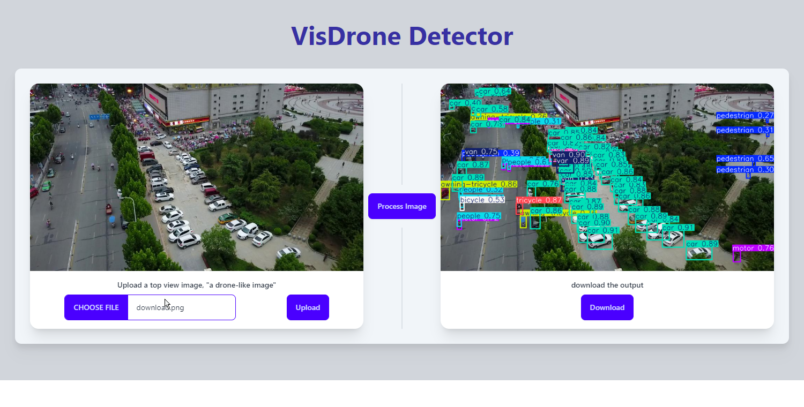
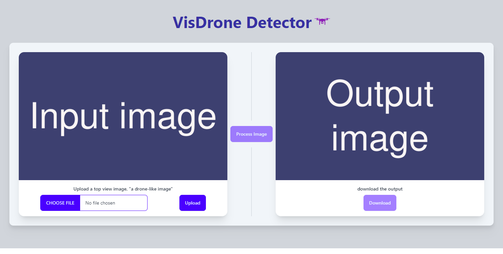
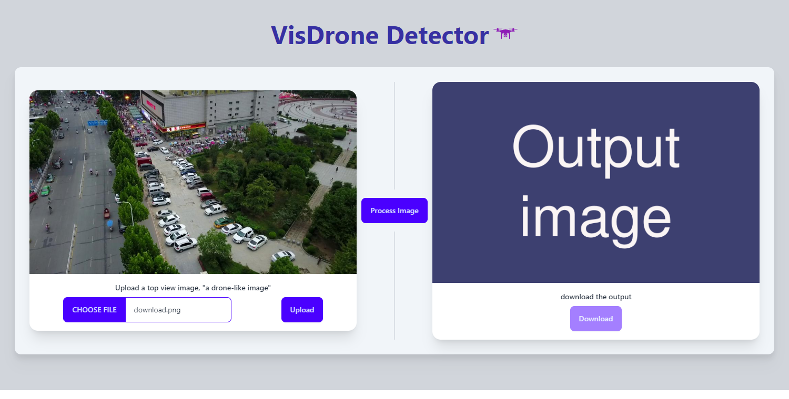
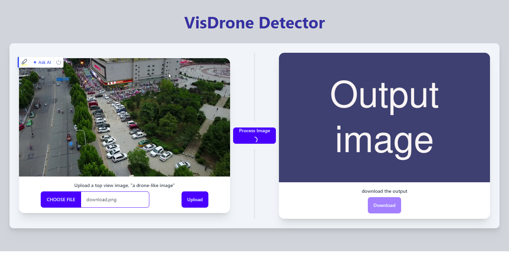

# VisDrone_Detector_Flask_APP

This as a web interface for a [YOLOv8](https://docs.ultralytics.com/) model, of size `x`, that has been trained on [VisDrone2019 dataset](https://github.com/VisDrone/VisDrone-Dataset).

### Dev Stack

- Flask
- HTMX
- Tailwindcss
- YOLOv8x model

### Screenshots

- Main page
  

- After uploading an image
  

- When the processing button is pressed
  

- After the inference result arrived from the server
  
