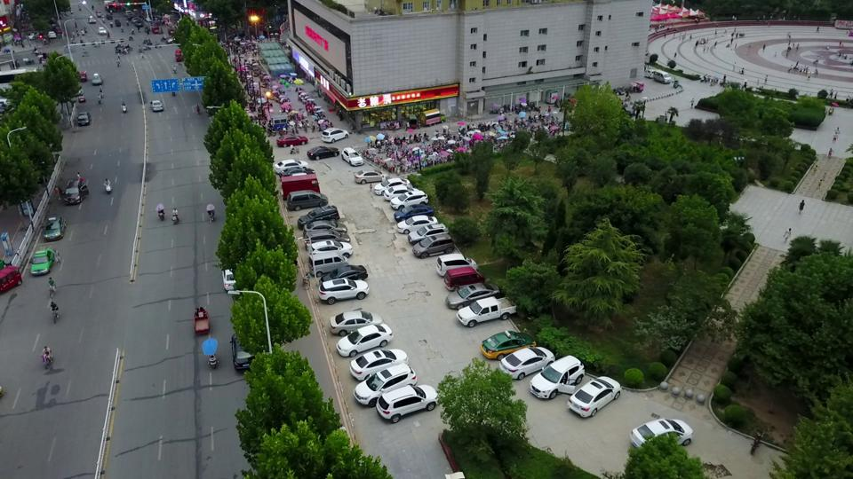
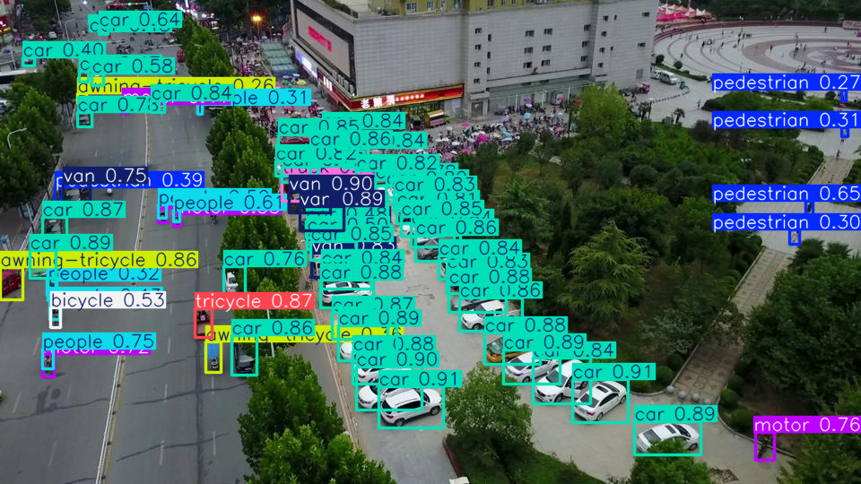

# VisDrone Object Detector Flask APP

 

This as a web interface for a [YOLOv8](https://docs.ultralytics.com/) model, of size `x`, that has been trained on [VisDrone2019 dataset](https://github.com/VisDrone/VisDrone-Dataset).

### Dev Stack

- Flask
- HTMX
- Tailwindcss
- YOLOv8x model

### Steps for running the app locally

1. Clone the repo.
2. Create a `models` directory inside `visdrone_det_app` directory and place a `YOLOv8` compatible model in there.
3. Create a `.env` file in the `root` directory, in which the following variables should be assigned values.

```bash
SECRET_KEY='a secret key for the flask app'
MODEL_NAME='The name of the model in use'
# The model should exists in visdrone_det_app/models
# the MODEL_NAME value should be the same as the name of the model file name
```

4. Create a `virtualenv` (if you want), I use [uv](https://docs.astral.sh/uv/).
5. Install the dependencies using the `requirements.txt` file.
   ```bash
    uv pip install -r requirements.txt
   ```
6. run the app
   ```bash
    uv run visdrone_det_app/main.py
   ```

### Screenshots

- Main page
  

- After uploading an image
  

- When the processing button is pressed
  

- After the inference result arrived from the server
  
